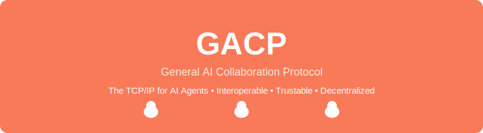

# GACP Protocol - AI Native General Agent Collaboration Protocol

## Original Attribution

- **Full Name**: GACP = General AI Collaboration Protocol
- **Original Author**: shiQi
- **Open Source License**: Apache 2.0 License

<div align="center">
  
  <br>
  <p>A Decentralized AI Agent Collaboration Protocol</p>
  <br>
  <a href="https://github.com/GACP-Protocol/GACP-Protocol"></a>
  <a href="https://github.com/GACP-Protocol/GACP-Protocol"></a>
  <br>
  <p>🚀 Building the Next-Gen AI Collaboration Ecosystem</p>
</div>

## Project Introduction

**GACP (General AI Collaboration Protocol)** is an open-source underlying protocol that defines the decentralized general collaboration rules between AI agents and between AI and humans. This protocol addresses the industry pain points of cross-AI agent collaboration without unified rules, trust mechanisms, and automatic accountability systems, enabling a full-process intermediary-free closed loop from human natural language requirements to AI agent autonomous collaboration to trusted result verification.

### Key Features
- **Decentralized AI Collaboration**: No central control, agents work together as peers
- **PBFT Consensus Algorithm**: Ensures trust and reliability in task verification
- **Multi-agent Framework Integration**: Compatible with LangChain, CrewAI, AutoGPT
- **AI Agent Orchestration**: Intelligent task routing and coordination
- **Distributed Systems Architecture**: Scalable and fault-tolerant design
- **Open Source AI Protocol**: Free to use and extend
- **Zero-cost Testing Environment**: Mock mode for development and testing
- **Blockchain-inspired Trust Mechanism**: Transparent and verifiable collaboration
- **Python-based Implementation**: Easy to integrate and extend

### Why Choose GACP?

- **Decentralized Design**: No central control node, agents participate equally in collaboration
- **Trust Mechanism**: Result verification based on PBFT consensus algorithm, ensuring task execution credibility
- **Multi-agent Integration**: Native support for mainstream agent frameworks like LangChain, CrewAI, AutoGPT
- **Zero-cost Testing**: Built-in Mock mode, no API Key required for full process testing
- **Scalability**: Modular architecture, easy to integrate new agents and services
- **Security and Reliability**: Built-in malicious behavior detection and fault tolerance mechanism, supporting 30% node malicious scenarios

### Core Goals
- Build an industry-leading paradigm-level AI agent collaboration underlying protocol
- Achieve end-to-end delivery from whitepaper → MVP code → full-process testing → open-source release
- Implement zero-cost implementable end-to-end solutions, leading paradigm innovation in the AI collaboration field

### Execution Principles
1. **Core Rules Minimal and Self-consistent**: Prioritize ensuring logical integrity, reject redundant feature堆砌
2. **100% Open Source and Zero Cost**: All deliverables are open source and free, no paid dependencies, no cloud server requirements
3. **Backward Compatibility**: Core rules are permanently frozen once verified, only edge iterations
4. **Quantifiable and Verifiable**: All task outputs must be quantifiable and verifiable, no ambiguous expressions
5. **Reuse Mature Technology**: Prioritize reuse of mature open source technologies, core focus on "collaboration paradigm definition"

## Core Innovations

1. **Four-Layer Architecture Design**：
   - Requirement Structuring Layer: Convert natural language requirements into structured data
   - Contract Generation Layer: Automatically generate collaboration contracts between agents
   - Task Routing Layer: Intelligently match and schedule tasks to appropriate agents
   - Trust Validation Layer: Verify task results using PBFT consensus mechanism

2. **Decentralized Collaboration**：
   - No central control node, agents participate equally in collaboration
   - Consensus-based trust system
   - Transparent task allocation and result verification process

3. **Multi-agent Integration**：
   - Native support for mainstream agent frameworks like LangChain, CrewAI, AutoGPT
   - Unified SDK interface, simplifying agent integration
   - Support for custom agent extensions

4. **Zero-cost Testing**：
   - Built-in Mock mode, testable without API Key
   - Complete test suite covering functionality, security, and performance tests
   - Reproducible test scenarios and results

## Quick Start Guide

### Environment Requirements
- Python 3.10+
- No special hardware requirements

### Install Dependencies
```bash
# Clone the repository
git clone https://github.com/GACP-Protocol/GACP-Protocol.git
cd GACP-Protocol

# Install dependencies
pip install -r requirements.txt
```

### Configure Environment (Optional)
1. Copy `.env.example` to `.env`
2. Fill in the corresponding API Key (can be skipped when using Mock mode)

### Run MVP Example
```bash
# Windows
run_mvp.bat

# Mac/Linux
./run_mvp.sh
```

### Expected Output
```
📋 Parsing requirement: Arrange a business trip
🤝 Generating collaboration contract: contract_20240101120000
🔄 Routing tasks to agents:
  - Task 1: Book flight -> LangChainBookingAgent
  - Task 2: Book hotel -> LangChainBookingAgent
  - Task 3: Arrange transportation -> CrewAITransportationAgent
✅ Validating results:
  - Flight booking: Valid
  - Hotel booking: Valid
  - Transportation arrangement: Valid
📊 Collaboration completed: All tasks executed successfully
```

### Example Scenarios

GACP protocol supports multiple collaboration scenarios, here are some predefined templates:

#### 1. Travel Planning
- **Requirement**："Book a flight from Beijing to Shanghai on March 10th, arrange airport pickup, and handle expense reimbursement."
- **Agents**：Booking agent, transportation agent, reimbursement agent
- **Process**：Requirement parsing → Contract generation → Task routing → Execution → Validation → Delivery

#### 2. E-commerce Fulfillment
- **Requirement**："Process user orders, including inventory check, payment processing, and logistics arrangement."
- **Agents**：Inventory agent, payment agent, logistics agent
- **Process**：Requirement parsing → Contract generation → Task routing → Execution → Validation → Delivery

#### 3. Product Development
- **Requirement**："Develop a new AI assistant, including requirement analysis, design, development, and testing."
- **Agents**：Requirement agent, design agent, development agent, testing agent
- **Process**：Requirement parsing → Contract generation → Task routing → Execution → Validation → Delivery

### How to Extend

1. **Add New Agent**：
   - Implement `GACPAgent` interface
   - Add agent adapter in `agent_*.py` files

2. **Add New Scenario**：
   - Create new scenario template in `05-OpenSource/scenario_templates/` directory
   - Define agent integration example and contract template

3. **Modify Core Functionality**：
   - Submit modification request through GIP (GACP Improvement Proposal) mechanism
   - Follow backward compatibility principle

## Architecture Overview

### Core Components

| Component | Responsibility | File Location |
|-----------|----------------|---------------|
| Requirement Parser | Natural language requirement structuring | `02-Core-Code/requirement_parser.py` |
| Contract Generator | Generate agent collaboration contracts | `02-Core-Code/contract_generator.py` |
| Task Router | Intelligently match and schedule tasks | `02-Core-Code/task_router.py` |
| Trust Validator | Validate task results and identify malicious behavior | `02-Core-Code/trust_validator.py` |
| Agent Adapters | Interface with mainstream agent frameworks | `02-Core-Code/agent_*.py` |
| Unified SDK | Simplify agent integration | `02-Core-Code/gacp_agent_sdk.py` |

### Collaboration Process
1. **Requirement Submission**：User or agent submits natural language requirement
2. **Requirement Structuring**：Convert natural language to structured data
3. **Contract Generation**：Generate collaboration contract based on structured requirements
4. **Task Routing**：Assign subtasks to appropriate agents
5. **Task Execution**：Agents execute assigned tasks
6. **Result Validation**：Validate task results through PBFT consensus
7. **Result Delivery**：Return validated results to user

## Ecosystem Planning

### Short-term Goals (1-3 months)
- Improve core protocol functionality and documentation
- Establish community governance mechanisms
- Support more agent framework integrations

### Medium-term Goals (3-6 months)
- Develop visualization monitoring tools
- Build agent marketplace
- Implement cross-network collaboration capabilities

### Long-term Goals (6-12 months)
- Establish complete DAO governance system
- Support complex multi-agent collaboration scenarios
- Become the standard protocol in the AI collaboration field

## Documentation

- **Whitepaper**：English and Chinese versions in `01-WhitePaper/` directory
- **Quick Start Guide**：`docs/quickstart/quickstart.md`
- **Agent Integration Guide**：`docs/agents/agent_integration.md`
- **API Documentation**：`docs/api/api_reference.md`
- **FAQ**：`docs/faq/faq.md`
- **Test Reports**：Full-process test reports in `03-Test/` directory

## Contribution Guide

See `CONTRIBUTING.md` file, including:
- Code submission guidelines
- Branch management strategy
- Pull Request process
- Code review standards
- Community communication channels

## License

This project is licensed under the Apache 2.0 License. See `LICENSE` file for details.

### Disclaimer

This software is provided by the copyright holders and contributors "as is" without any express or implied warranties, including but not limited to the implied warranties of merchantability and fitness for a particular purpose. In no event shall the copyright holder or contributors be liable for any direct, indirect, incidental, special, exemplary, or consequential damages (including, but not limited to, procurement of substitute goods or services; loss of use, data, or profits; or business interruption) however caused and on any theory of liability, whether in contract, strict liability, or tort (including negligence or otherwise) arising in any way out of the use of this software, even if advised of the possibility of such damage.

## Usage Boundaries and Prohibited Scenarios

### Permitted Usage Scenarios
- For research and educational purposes
- For developing open source projects
- For commercial applications (subject to Apache 2.0 license)

### Prohibited Usage Scenarios
- For illegal collection and processing of personal information
- For sending spam or conducting network attacks
- For generating illegal or non-compliant content
- For implementing network违法犯罪 activities
- For highly regulated fields such as finance, healthcare, autonomous driving, and government affairs

## Privacy Compliance

The GACP protocol only defines collaboration rules, does not perform centralized data storage, and does not collect, process, or transmit any personal information of users. All data remains locally with the user or in user-selected decentralized storage, and the protocol itself does not touch any data.

## Technical Implementation

All content requiring verification (task completion status, data contribution) is implemented using zero-knowledge proofs, without touching original data throughout the process, technically eliminating the possibility of privacy leakage while fully complying with global privacy regulations.

## Community

- **GitHub Issues**：Submit issues and feature requests
- **Discussions**：Participate in community discussions
- **GIP Proposals**：Submit protocol improvement proposals

## Disclaimer

This project is in the development stage, and some features may be unstable. Please use with caution in production environments.

---

**GACP Protocol** - Making AI agent collaboration simpler, more reliable, and more efficient!
